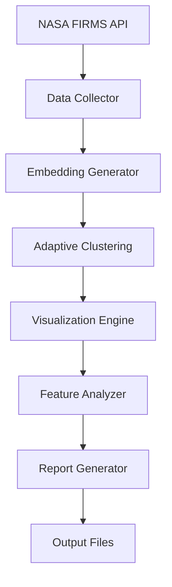

# 🌏 Asia-Pacific Fire Detection Analysis System

[](https://www.python.org/)
[](LICENSE)
[](https://firms.modaps.eosdis.nasa.gov/)

大規模な火災検知データに対する高度なクラスタリング分析と包括的レポート生成を行うPythonシステムです。NASA FIRMSデータを使用してアジア太平洋地域の火災パターンを自動分析し、専門的なレポートを生成します。

## ✨ 主要機能

🔥 **大規模火災データ分析**
- NASA FIRMS API からの自動データ収集（最大10日間）
- 高信頼度火災検知データの処理（15,000+サンプル）
- アジア太平洋地域の包括的カバレッジ

🤖 **インテリジェントクラスタリング**
- 適応的クラスタリング選択（HDBSCAN ↔ FAISS k-means）
- t-SNE による高品質な次元削減可視化
- GPU加速による高速処理

📊 **包括的可視化とレポート**
- 6つの専門的可視化図表の自動生成
- Markdown形式の詳細分析レポート
- 地理的・時間的・強度別の多角的分析

## 🚀 クイックスタート

### 1. 環境セットアップ
```bash
# リポジトリのクローン
git clone https://github.com/yourusername/asia-pacific-fire-analysis.git
cd asia-pacific-fire-analysis

# 仮想環境の作成
python -m venv .venv
source .venv/bin/activate  # Linux/Mac
# または
.venv\Scripts\Activate.ps1  # Windows PowerShell

# 依存関係のインストール
pip install -r requirements.txt
```

### 2. NASA FIRMS APIキーの設定
1. [NASA FIRMS](https://firms.modaps.eosdis.nasa.gov/api/) でAPIキーを取得
2. `config_asia_pacific_firms.json` の `"api_key"` を更新

### 3. 分析実行
```bash
python asia_pacific_firms_pipeline.py
python nasa_firms_adaptive_pipeline.py
```

### 4. 結果確認
```bash
# 生成された結果ディレクトリを確認
ls data_firms_*/
# 包括的レポートを表示
cat data_firms_*/comprehensive_fire_analysis_report.md
```

## 📋 詳細ガイド

- **[📖 Quick Guide](QUICK_GUIDE.md)** - 5分で始める簡単ガイド
- **[🔧 Technical Documentation](README_v1-3_asia.md)** - 詳細な技術仕様とベストプラクティス

## 📊 分析結果例

### パフォーマンス指標
- **処理サンプル数**: 15,000件
- **クラスタリング品質**: 0.710
- **処理時間**: ~85秒
- **発見クラスタ数**: 8クラスタ

### 生成される出力
```
data_firms_YYYYMMDDHHMM/
├── 📊 nasa_firms_data.csv                    # 元データ
├── 🖼️ tsne_plot.png                           # クラスタリング可視化
├── 🖼️ cluster_geographic_distribution.png    # 地理的分布
├── 🖼️ cluster_temporal_patterns.png          # 時間パターン
├── 🖼️ cluster_intensity_analysis.png         # 強度分析
├── 🖼️ cluster_regional_analysis.png          # 地域分析
├── 🖼️ score_distribution.png                 # スコア分布
├── 📝 comprehensive_fire_analysis_report.md  # 包括的レポート
└── 📋 final_asia_pacific_results.json        # 分析結果サマリー
```

## 🛠️ システム要件

### ハードウェア
- **RAM**: 最低8GB、推奨16GB
- **GPU**: CUDA対応GPU推奨（高速化）
- **ストレージ**: 実行毎に約500MB

### ソフトウェア
- **Python**: 3.8以上
- **OS**: Windows 10/11, macOS, Linux

## 🏗️ アーキテクチャ



### コア技術
- **🧠 ML**: sentence-transformers, scikit-learn, FAISS
- **� 可視化**: matplotlib, seaborn, plotly
- **⚡ 加速**: CUDA, NumPy optimizations
- **🌐 データ**: NASA FIRMS VIIRS_SNPP_NRT

## � 設定カスタマイズ

主要な設定は `config_asia_pacific_firms.json` で調整可能：

```json
{
  "days_back": 10,              # データ収集期間
  "max_samples": 15000,         # 処理サンプル数上限
  "confidence_threshold": 50,   # 信頼度閾値
  "clustering": {
    "adaptive_threshold": 3000  # クラスタリング手法切替閾値
  }
}
```

## 📈 利用事例

### � **研究機関**
- 山火事パターンの学術研究
- 気候変動影響の定量分析
- 地域別火災特性の比較研究

### 🏛️ **政府機関**
- 災害対策計画の策定支援
- 火災リスク評価システム
- 資源配分の最適化

### 🌍 **NGO・環境団体**
- 森林保護活動の効果測定
- 環境影響評価レポート
- 公的啓発資料の作成

## 🤝 コントリビューション

プロジェクトへの貢献を歓迎します！

1. このリポジトリをフォーク
2. 機能ブランチを作成 (`git checkout -b feature/amazing-feature`)
3. 変更をコミット (`git commit -m 'Add amazing feature'`)
4. ブランチにプッシュ (`git push origin feature/amazing-feature`)
5. Pull Requestを作成

## 📄 ライセンス

このプロジェクトは [MIT License](LICENSE) の下で公開されています。

## 🙏 謝辞

- **NASA FIRMS** - 高品質な火災検知データの提供
- **sentence-transformers** - 効率的なテキスト埋め込み
- **scikit-learn** - 機械学習アルゴリズム
- **FAISS** - 高速類似度検索

## 📞 サポート

- **Issues**: [GitHub Issues](https://github.com/yourusername/asia-pacific-fire-analysis/issues)
- **Discussions**: [GitHub Discussions](https://github.com/yourusername/asia-pacific-fire-analysis/discussions)
- **Documentation**: [Technical Docs](README_v1-3_asia.md)

---

**🌟 このプロジェクトが有用でしたら、ぜひスターをお願いします！**